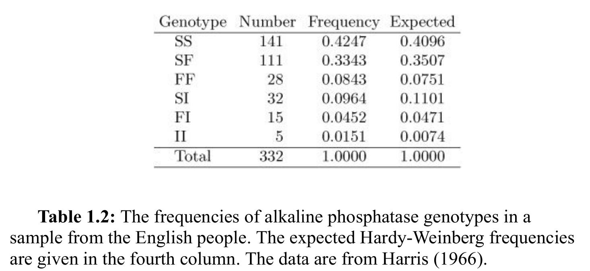
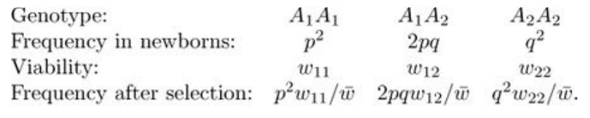
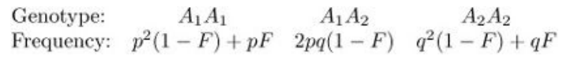
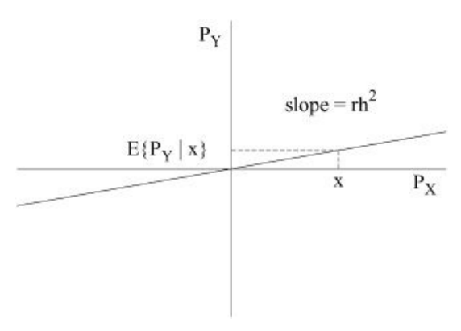

---
output:
  pdf_document:
    toc: yes
    toc_depth: 3
    fig_caption: true
    keep_tex: true
    number_sections: true
    latex_engine: xelatex
    includes:
      before_body: docs/cover.tex
fontsize: 11pt
mainfont: Verdana
header-includes:
  - \usepackage{float}
  - \usepackage{graphicx}
  - \usepackage{geometry}
  - \usepackage{float}
  - \floatplacement{figure}{H}
bibliography: "docs/references.bib"
editor_options:
  markdown:
    wrap: 72
---

\newpage


```{r setup, echo=FALSE}
knitr::opts_chunk$set(echo = TRUE)
```

```{r librerías, echo=FALSE}
library(ggplot2)
```

Fundamento teórico y ejercicios del libro *Population Genetics: A Concise Guide* (@gillespie2004)

# Genetic Variation

## Problem 1.2

***Using table 1.2, calculate the frequency of the three alkaline phosphatase alleles in the English population***

> 2 points



La frecuencias de un alelo se logra sumando todas las frecuencias genotípicas
observadas que lo ivolucren, pero dividiendo entre dos las de heterocigotos
($f(pq)/2$) a modo de penalización, porque solo cuenta con el alelo diana una
vez, al contrario del caso homocigoto:

$$
p_A = f(AA) + \frac{1}{2}f(AB) + \frac{1}{2}f(AC)
$$

Dados los alelos **S**, **F** e **I**:

```{r problema 1, echo=TRUE}
knitr::opts_chunk$set(
	echo = TRUE,
	message = FALSE,
	warning = FALSE
)

# Freqs. genotípicas
SS <- 0.4247
SF <- 0.3343
FF <- 0.0843
SI <- 0.0964
FI <- 0.0452
II <- 0.0151

# Freqs. alélicas
S <- SS + SF/2 + SI/2
F <- SF/2 + FF + FI/2
I <- SI/2 + FI/2 + II
```

Así, las frecuencias alélicas de los tres alelos en la población inglesa son:
```{r Resultados problema 1, echo=FALSE}
cat("Frecuencia del alelo S:", round(S, 4), "\n")
cat("Frecuencia del alelo F:", round(F, 4), "\n")
cat("Frecuencia del alelo I:", round(I, 4), "\n")
```

# Genetic Drift

## Problem 2.2

***Write a simulation of genetic drift. Provide your code and resulting plot***

> 5 points

La deriva genética es un proceso estocástico, pudiendo causar fluctuaciones en las frecuencias alélicas de una población a lo largo del tiempo, especialmente notorios a medida que la población es más pequeña.
Con base en el libro, se simula este proceso usando el modelo de *Wright-Fisher*, que cuenta con las siguientes características:

- Población de tamaño constante
  - 50 individuos diploides

- Generaciones discretas

- Reproducción aleatoria
  - $Ne$ = $N$

- Sin mutación

- Sin selección natural

La deriva génica se modela directamente con una distribución binomial, donde el número de éxitos representa el número de alelos `A` en la siguiente generación, y la probabilidad de éxito es la *frecuencia del alelo `A`* (`p`) en la generación pasada. Asimismo, la frecuencia de `A` se actualiza en cada generación, dividiendo el número de `A`s entre el total de alelos.

```{r problema 2, echo=TRUE}
set.seed(123) # Arbitraria, para reproducibilidad

# Parámetros
num_generations <- 100
population_size <- 50
num_simulations <- 5

# Función de simulación
simulate_drift <- function(num_generations, population_size) {
  # Vector en 0s de longitud 100
  allele_freq <- numeric(num_generations)
  # Freq. inicial del alelo A
  allele_freq[1] <- 0.5

  # Simulación
  for (gen in 2:num_generations) { # La 1 es la de la freq. inicial
    # Selección aleatoria de alelos
    # Nuevo num. de A's
    alleles <- rbinom(population_size, 2, allele_freq[gen - 1])
    # Nueva freq. de A
    allele_freq[gen] <- sum(alleles) / (2 * population_size)
  }

  return(allele_freq)
}

# Plot base --> Solo con etiquetas
plot(NULL,
  xlim = c(1, num_generations),
  ylim = c(0, 1),
  xlab = "Generation",
  ylab = "Allele frequency",
  main = "Genetic Drift Simulation")

# Distintas simulaciones con seed diferente
for (sim in 1:num_simulations) {
  freqs <- simulate_drift(num_generations, population_size)
  # Simulación agregada al plot
  lines(1:num_generations, freqs)
}
```

Observamos que, a lo largo de las generaciones, las frecuencias alélicas fluctúan de manera aleatoria, ocasionando que en algunos casos el alelo se fije ($p_A = 1$) o, al contrario, se pierda ($p_A = 0$).

## Problem 2.4

***Graph $H_t$ and $G_t$ for 100 generations with $H_0 = 1$ and population sizes of $N=1$, $10$, $100$, and $1,000,000$***

> 5 points

- $H_t$: heterocigosidad a través del tiempo
- $G_t$: homocigosidad a través del tiempo

Sabemos que la heterocigosidad se calcula con la siguiente fórmula del libro:

$$
H_t = H_0 \left(1 - \frac{1}{2N}\right)^t
$$

Así, se grafican los valores de $H_t$ y $G_t$ (el complemento de $H_t$) para cada tamaño poblacional:

> Dado que $H_0 = 1$, no se incluye en la fórmula

```{r problema 4, echo=TRUE}
# Parámetros
num_generations <- 100
t <- 0:num_generations
population_sizes <- c(1, 10, 100, 1e6)

# Data frame acumulado
all_data <- data.frame()

# Para cada N
for (N in population_sizes) {
  # Ht --> Operación ya vectorizada
  H_t <- (1 - 1/(2 * N))^t
  # Gt
  G_t <- 1 - H_t

  # Data frame por N
  df <- data.frame(
  Generation = rep(t, 2),
  Value = c(H_t, G_t),
  # Factor para diferenciar Ht y Gt
  Metric = factor(rep(c("Ht", "Gt"), each = length(t))),
  N = factor(N)
  )

  # Acumular data frame
  all_data <- rbind(all_data, df)
}
```

```{r Plot Ht y Gt, echo=FALSE}
# Plot
plot <- ggplot(all_data,
  aes(x = Generation, y = Value,
  color = N,
  linetype = Metric)) +
  geom_line(alpha = 0.8) +
  labs(title = "Ht y Gt bajo deriva génica",
    x = "Generación",
    y = "Frecuencia",
    color = "Tamaño poblacional (N)",
    linetype = "Métrica") +
  theme_minimal() +
  theme(
  plot.title = element_text(size = 10),
  axis.title = element_text(size = 9),
  axis.text = element_text(size = 8),
  legend.position = "bottom",
  legend.box = "horizontal",
  legend.title = element_text(size = 8),
  legend.text = element_text(size = 7)
  )

# Mostrar plot
plot
```

Se observa la tendencia de la heterocigosidad ($Ht$) a disminuir a medida que pasan las generaciones, especialmente cuando la $N$ es pequeña, mientras que la homocigosidad ($Gt$) aumenta. En poblaciones grandes, la tasa de este cambio es mucho más lenta, evidenciando el efecto de la deriva genética.

## Problem 2.10

***If the human generation time is 20 years, what effective population size for humans is implied by the data?***

> 2 points

El libro establece que el tiempo para que la heterocigosidad se reduzca a la mitad ($t_{1/2}$) es $t_{1/2} \approx 2N_e \ln(2)$. Esto implica que el tiempo de decaimiento de la variación genética es proporcional al tamaño efectivo de la población.
Podemos despejar $N_e$ de la fórmula:

$$
N_e \approx \frac{t_{1/2}}{2 \ln(2)}
$$

Además, se da el ejemplo de una población de tamaño $N = 10^6$, para la que se requieren aproximadamente $1.38 \times 10^6$ generaciones para reducir la heterocigosidad a la mitad.

Si el tiempo generacional es de 20 años, esto corresponde a $1.38 \times 10^6 \times 20 \approx 2.8 \times 10^7$ años, es decir, ~28 millones de años:

```{r tiempo_N_1e6, echo=TRUE}
generations <- 1.38e6
generation_time <- 20 # años
time_years <- generations * generation_time
time_years
```

Sin embargo, en humanos la variación genética observable ha cambiado en escalas de tiempo evolutivas mucho más cortas (del orden de cientos de miles de años), y no desde el Oligoceno para acá. Esto implica que el tiempo de pérdida de heterocigosidad es mucho menor que el del ejemplo ($N_e < 10^6$).

Dado que $t_{1/2} \propto N_e$ y cambian linealmente, una reducción de $n$ órdenes de magnitud en el tiempo implica una reducción similar en el tamaño efectivo. Asumiendo que la escala de tiempo para humanos es del orden de $10^5$ años y recordando que las generaciones son de 20 años, el tiempo en generaciones sería $10^5 / 20 = 5 \times 10^3$ generaciones.

Comparando esto con el tiempo para $N = 10^6$, observamos que $\frac{5 \times 10^3}{1.38 \times 10^6} \approx 3.6 \times 10^{-3} \sim 10^{-2}$:

```{r tiempo para humanos, echo=TRUE}
5e3 / 1.38e6
```

Esto corresponde aproximadamente a una reducción de dos órdenes de magnitud. Por lo tanto, el tamaño efectivo de la población humana sería:

$$
N_e \approx (10^6)(10^-2) = 10^4
$$

Este es un ejemplo muy claro de que el tamaño efectivo de la población humana es mucho menor que su tamaño censal, reflejando la influencia de la deriva genética en escalas evolutivas.

# Natural Selection

## Problem 3.1

***In 1940, the frequency of the medionigra allele in the Oxford population was about $p = 0.1$. If the viabilities of the three genotypes were $w_{11} = 0.9$, $w_{12} = 0.95$, and $w_{22} = 1$, what would be the frequency of medionigra in the newborns of 1941?***

> 2 points

Recordamos la tabla del libro:



Sabemos que $p = 0.1$, por lo que $q = 1 - p = 0.9$. Además, se nos dan las viabilidades de los genotipos:

- $w_{11} = 0.9$ (homocigoto *medionigra*)

- $w_{12} = 0.95$ (heterocigoto)

- $w_{22} = 1$ (homocigoto alternativo)

Así, para encontrar $p'$

$$
p' = \frac{p^2 w_{11} + pq w_{12}}{\bar{w}}
$$

donde $\bar{w}$ es la viabilidad media de la población:

$$
\bar{w} = p^2 w_{11} + 2pq w_{12} + q^2 w_{22}
$$

```{r problema 5, echo=TRUE}
# Parámetros
p <- 0.1
q <- 1 - p
w11 <- 0.9
w12 <- 0.95
w22 <- 1

# Viabilidad media
w_bar <- p^2 * w11 + 2 * p * q * w12 + q^2 * w22

# Frecuencia después de selección
p_prima <- (p^2 * w11 + p * q * w12) / w_bar
p_prima
```

## Problem 3.2

***If the fitnesses of the genotypes $A_{1}A_1$, $A_{1}A_2$ and $A_{2}A_2$ are $w_{11} = 1.5$, $w_{12} = 1.1$, and $w_{22} = 1.0$, respectively, what are the values of the selection coefficient and the heterozygous effect?***

> 2 points

El *fitness* se entiende relativo a un genotipo, en este caso $A_{2}A_2$ con $w_{22} = 1.0$. Dado esto, el *fitness* del genotipo $A_{1}A_{1}$, $w_{11}$, puede entenderse como 1 más el **efecto de la selección** ($s$). A su vez, el del heterocigoto ($A_{1}A_{2}$), $w_{12}$, es igualmente 1 más los efectos de la selección ($s$) y de cuánto de eso *permea* en el heterocigoto, ergo, la **dominancia** ($h$):

$$
w_{12}/w_{22} = 1 + hs \text{, } w_{11}/w_{22} = 1 + s
$$

o, dado que $w_{22} = 1$, lo que es igual:

$$
w_{12} = 1 + hs \text{, } w_{11} = 1 + s
$$

Despejando, obtenemos que $s = w_{11} - 1$ y $h = \frac{w_{12} - 1}{s}$:

```{r problema 6, echo=TRUE}
# Parámetros
w11 <- 1.5
w12 <- 1.1
w22 <- 1.0
# Coeficiente de selección
s <- w11 - 1
# Efecto de la dominancia
h <- (w12 - 1) / s
```

```{r resultados problema 6, echo=FALSE}
cat("Selection coefficient (s):", round(s, 2), "\n")
cat("Heterozygous effect (h):", round(h, 2), "\n")
```

El que $s$ sea positivo indica que el alelo $A_1$ es ventajoso (su *fitness* es mejor que el que confiere $A_2$), mientras que el valor de $h$ menor a 1 implica que el efecto de la selección en el heterocigoto es menor que en el homocigoto, es decir, hay una **dominancia incompleta** del alelo $A_1$ sobre $A_2$.

## Problem 3.5

***Write down Equation 3.2 for the special case $h = 0.5$. Find the allele frequencies in two successive generations ($p'$ and $p''$) when the initial value of $p = 0.1$ and $s = 0.1$. Continue this for 200 generations and graph the result***

> 5 points

Cuando $h = 0.5$, tenemos un caso de **dominancia incompleta** que nos habla de una **selección direccional**. La ecuación 3.2 es:

$$
\Delta_{s}p = \frac{pqs[ph + q(1 -h)]}{\bar{w}}
$$

donde $\bar{w} = 1 - 2pqhs -q^2s$

A su vez, ${\Delta}_{s}p$ es el cambio en la frecuencia alélica debido a la selección, por lo que $p' = p + {\Delta}_{s}p$ y por consiguiente $p'' = p' + {\Delta}_{s}p'$.

Escribimos la ecuación particular para $h = 0.5$:

$$
\Delta_{s}p = \frac{pqs[0.5p +
0.5q]}{\bar{w}} = \frac{pqs[0.5(p + q)]}{\bar{w}} = \frac{pqs[0.5]}{\bar{w}} = \frac{0.5pqs}{\bar{w}}
$$

y planteamos el modelo para $p$:

$$
p_{t+1} = p_t + \frac{0.5p_t q_t s}{\bar{w}_t}
$$

```{r problema 7, echo=TRUE}
# Parámetros
s <- 0.1
h <- 0.5
num_generations <- 200
# Desde p_0 hasta p_200 (Por eso es mejor python :P)
p <- numeric(num_generations + 1)
p[1] <- 0.1
q <- 1 - p[1]

# Apóstrofe de p para imprimir
prima <- ""

for (t in 1:num_generations) {
  if (t <= 3) {
    cat(
        "Generación: ", t, "\tp", prima, ": ",
        round(p[t], 4), "\tq", prima, ": ", round(q, 4), "\n", sep = ""
        )
    prima <- paste0(prima, "'")
  }
  q <- 1 - p[t]
  mean_w <- 1 - 2 * p[t] * q * h * s - q^2 * s
  delta_p <- (0.5 * p[t] * q * s) / mean_w
  p[t + 1] <- p[t] + delta_p
}
```

```{r plot problema 7, echo=FALSE}
# Data frame
df <- data.frame(
  Generation = 0:num_generations,
  Allele_Frequency = p
)
# Plot
ggplot(df, aes(x = Generation, y = Allele_Frequency)) +
  geom_line(color = "blue", linewidth = 1) +
  labs(title = "Cambio en frecuencia alélica bajo selección",
    subtitle = "h = 0.5 (dominancia incompleta), s = 0.1",
    x = "Generación",
    y = "Frecuencia de A1") +
  theme_minimal() +
  theme(
    plot.title = element_text(size = 11),
    plot.subtitle = element_text(size = 9),
    axis.title = element_text(size = 9),
    axis.text = element_text(size = 8)
  )
```

La gráfica describe una forma sigmoide-*like*. Se observa que la frecuencia alélica aumenta hasta fijarse ($p = 1$), con su mayor tasa de cambio en valores intermedios de $p$, lo cual es consistente con la teoría de selección direccional bajo dominancia incompleta.

## Problem 3.7

***Graph ${\Delta}_{s}p$ versus $p$ for an underdominant locus***

> 5 points

Este caso implica selección disruptiva, donde el heterocigoto tiene menor *fitness* que ambos homocigotos ($w_{12} < w_{11}$, $w_{12} < w_{22}$).

Para graficar ${\Delta}_{s}p$ contra $p$ usamos de nueva cuenta:

$$
\Delta_{s}p = \frac{pqs[ph + q(1 -h)]}{\bar{w}}
$$

y la parametrización canónica del libro, relativa a $w_{11}$:

$$
w_{11} = 1, \quad w_{12} = 1 - hs, \quad w_{22} = 1 - s
$$

lo cual se traduce en un valor de $h > 1$.

Definiendo arbitrariamente $s = 0.1$ y $h = 1.5$, podemos graficar ${\Delta}_{s}p$ contra $p$, donde $0 < p < 1$:

```{r problema 8, echo=TRUE}
# Parámetros
s <- 0.1
h <- 1.5
# p de 0 a 1
p <- seq(0, 1, length.out = 100)
# q de 1 a 0
q <- 1 - p
mean_w <- 1 - 2 * p * q * h * s - q^2 * s
delta_p <- (p * q * s * (h * p + q * (1 - h))) / mean_w
```

```{r plot problema 8, echo=FALSE}
# Data frame
df <- data.frame(
  p = p,
  delta_p = delta_p
)

# Plot
ggplot(df, aes(x = p, y = delta_p)) +
  geom_line(color = "blue", linewidth = 1) +
  geom_hline(yintercept = 0, linetype = "dashed") +
  labs(title = expression(Delta[s] * p ~ "vs" ~ p),
    subtitle = "h = 1.5 (underdominance), s = 0.1",
    x = "p",
    y = expression(Delta[s] * p)) +
  theme_minimal() +
  theme(
    plot.title = element_text(size = 11),
    plot.subtitle = element_text(size = 9),
    axis.title = element_text(size = 9),
    axis.text = element_text(size = 8)
  )
```

La gráfica muestra que existe un punto intermedio donde $\Delta_s p = 0$, el cual corresponde a un equilibrio inestable. Para valores de $p$ menores a este punto, $\Delta_s p < 0$, la frecuencia alélica tiende a 0, mientras que para valores mayores, $\Delta_s p > 0$, la frecuencia tiende a 1.

# Linkage Disequilibrium

## Problem 4.1

***Derive the three equations for the frequencies of the $A1B2$, $A2B1$, and $A2B2$ gametes after a round of random mating***

> 2 points

Del libro obtenemos que:

$$
x'_{1} = (1−r)x_{1} + rp_{1}p_{2}
$$

donde $p_1$ es la frecuencia del alelo $A_1$ y $p_2$ la del $B_1$, el primer término de lado derecho es la probabilidad de tener un gameto $A_1B_1$ sin recombinación, y el segundo es la probabilidad de obtener este mismo gameto pero por recombinación, a partir de los alelos $A_1$ y $B_1$.

Así, para los gametos $A_1B_2$, $A_2B_1$ y $A_2B_2$, respectivamente:

$$
x'_{2} = (1−r)x_{2} + rp_{1}(1 - p_{2})
$$
$$
x'_{3} = (1−r)x_{3} + r(1 - p_{1})p_{2}
$$
$$
x'_{4} = (1−r)x_{4} + r(1 - p_{1})(1- p_{2})
$$

# Population subdivision

## Problem 5.1

***Find $p$ and $F$ for a population in which the genotype frequencies $A_1A_1$, $A_1A_2$, and $A_2A_2$ are $0.056$, $0.288$, and $0.656$, respectively***

Recuperamos la tabla del libro:



$p$, al igual que antes, es la frecuencia del alelo $A_1$ y se calcula con la fórmula:

$$
p = f(A_1A_1) + \frac{1}{2}f(A_1A_2)
$$

lo que nos da $q = 1 - p$. Por otro lado, $F$ es el coeficiente de endogamia, que compara cuánto difiere la heterocigosidad observada de la esperada por *Hardy-Weinberg*. Dado esto, derivamos del caso heterocigoto de la tabla:

$$
F = 1 - \frac{f(A_1A_2)}{2pq}
$$

donde $2pq$ es la heterocigosidad esperada por *Hardy-Weinberg*, $H_e$, y $f(A_1A_2)$ la heterocigosidad observada, $H_o$:

$$
F = 1 - \frac{H_o}{H_e}
$$

Se computan $p$ y $F$:

```{r problema 9, echo=TRUE}
# Parámetros
A11 <- 0.056
A12 <- 0.288

# Frecuencia alélica
p <- A11 + A12 / 2
q <- 1 - p

# Coeficiente de endogamia
F <- 1 - (A12 / (2 * p * q))
```

```{r resultados problema 9, echo=FALSE}
cat("Frecuencia del alelo A1 (p):", round(p, 4), "\n")
cat("Inbreeding coefficient (F):", round(F, 4), "\n")
```

Nótese que no se necesita la frecuencia del genotipo $A_2A_2$ porque no involucra al alelo $A_1$.

> 2 points

## Problem 5.10

***Calculate $F_{ST}$ for the data in `Table 1.3`. Pretend that there are only two alleles by using the $S$ alleles for $A_1$ and lumping the other alleles into $A_2$. First, assume that all of the subdivisions are the same size ($c_i = 1/8$). Next, assume that***

$$
c_i =
\begin{cases}
0.2 & i = 1,2,3,4 \\
0.05 & i = 5,6,7,8
\end{cases}
$$

> 3 points


Se sabe que $F_{ST} = \frac{H_T - H_S}{H_T}$, donde $H_T$ es la heterocigosidad total y $H_S$ la heterocigosidad promedio dentro de las subpoblaciones. Para calcular $H_T$, se necesita la frecuencia alélica global, que se obtiene haciendo un promedio ponderado de las frecuencias alélicas de cada subpoblación:

$$
\bar{p} = \sum_{i=1}^{k} c_i p_i
$$

donde $p_i$ es nuevamente la frecuencia del alelo $A_1$ (en este caso, el alelo $S$) en la subpoblación $i$, y $c_i$ es su peso relativo.

A partir de esto, la heterocigosidad total se obtiene como la heterocigosidad esperada bajo *Hardy-Weinberg*, usando la frecuencia global:

$$
H_T = 2\bar{p}(1 - \bar{p})
$$

Igualmente, la heterocigosidad dentro de cada subpoblación es de nueva cuenta $H_i = 2p_i(1 - p_i)$, por lo que la heterocigosidad promedio dentro de subpoblaciones se vuelve:

$$
H_S = \sum_{i=1}^{k} c_i \, 2p_i(1 - p_i)
$$

```{r problema 10, echo=TRUE}
# Frecuencias del alelo S (A1) por subpoblación
p <- c(
  England = 0.637,
  Italy = 0.661,
  West_India = 0.701,
  Thailand = 0.746,
  Japan = 0.724,
  Nigeria = 0.942,
  Inuit = 0.556,
  Papua_NG = 0.880
)

H_i <- 2 * p * (1 - p)

# Caso 1 --> c_i = 1/8
c_equal <- rep(1/8, length(p))
# Freq global
glob_p <- sum(c_equal * p)
# Heterocigosidad total
H_T_equal <- 2 * glob_p * (1 - glob_p)
# Heterocigosidad promedio
H_S_equal <- sum(c_equal * H_i)
# Fst
F_ST_equal <- (H_T_equal - H_S_equal) / H_T_equal


# Caso 2 --> pesos desiguales
# 4 subpoblaciones con cada peso
c_weighted <- c(0.2, 0.2, 0.2, 0.2, 0.05, 0.05, 0.05, 0.05)
# Freq. global
p_bar_weighted <- sum(c_weighted * p)
# Heterocigosidad total
H_T_weighted <- 2 * p_bar_weighted * (1 - p_bar_weighted)
# Heterocigosidad promedio
H_S_weighted <- sum(c_weighted * H_i)
# Fst
F_ST_weighted <- (H_T_weighted - H_S_weighted) / H_T_weighted
```

```{r resultados problema 10, echo=FALSE}
cat("Caso 1 (c_i = 1/8):\n")
cat("p⁻ =", round(glob_p, 4), "\n")
cat("H_T =", round(H_T_equal, 4), "\n")
cat("H_S =", round(H_S_equal, 4), "\n")
cat("F_ST =", round(F_ST_equal, 4), "\n\n")

cat("Caso 2 (pesos desiguales):\n")
cat("p⁻ =", round(p_bar_weighted, 4), "\n")
cat("H_T =", round(H_T_weighted, 4), "\n")
cat("H_S =", round(H_S_weighted, 4), "\n")
cat("F_ST =", round(F_ST_weighted, 4), "\n")
```

Vemos que el valor de $F_{ST}$ es sustancialmente más alto en el caso de un solo peso, debido a que, al ponderar más fuertemente a ciertas subpoblaciones, se modifican tanto la frecuencia alélica global como la heterocigosidad promedio dentro de poblaciones.

Se observa que, al asignar menor peso a poblaciones con frecuencias alélicas más extremas (como Nigeria), la heterogeneidad entre subpoblaciones disminuye, y eso se refleja en un $F_{ST}$ menor, mostrando que $F_{ST}$ no es propio del sistema, sino que depende de cómo se ponderen las subpoblaciones.

*Does the fact that $F_{ST}$ depends on your assumption about the $c_i$ make you nervous?*

Si bien esto podría parecer preocupante, en realidad refleja que $F_{ST}$ describe la estructura genética relativa a un esquema de muestreo o a la definición de la población total. Es decir, el valor de $F_{ST}$ depende de cómo se ponderan las subpoblaciones, pero esto **no** cambia la forma en que la variación genética está distribuida, sino cómo se resume.

# Quantitative Genetics

## Problem 6.4

The following measurements of weights are from a single parent and its offspring and are expressed as deviations from the mean. What is the heritability of this trait?

$$
(-0.002, -0.391),\ (1.566, 1.747),\ (0.542, -2.127),\ (-0.285, -1.623),\ (-1.519, -0.876),
$$

$$
(-1.136, -0.705),\ (0.907, 0.458),\ (0.435, -0.287),\ (1.292, 0.153),\ (-0.640, 0.711)
$$

**(2 points)**



La heredabilidad ($h^2$) puede estimarse como la **pendiente de la regresión** de los valores del descendiente entre los del progenitor. Esto equivale a:

$$
h^2 = \beta = \frac{\text{Cov}(P_X,P_Y)}{\text{Var}(P_X)} = rh^2
$$

donde $X$ representa el valor del progenitor y $Y$ el del descendiente.

```{r problema 11, echo=TRUE}
# Parent y offspring dados
data <- matrix(c(
  -0.002, -0.391,
   1.566,  1.747,
   0.542, -2.127,
  -0.285, -1.623,
  -1.519, -0.876,
  -1.136, -0.705,
   0.907,  0.458,
   0.435, -0.287,
   1.292,  0.153,
  -0.640,  0.711
), ncol = 2, byrow = TRUE)

# Separar variables
parent <- data[,1] # Col 1
offspring <- data[,2] # Col 2

# Correlación
r <- cor(parent, offspring)

# R^2 para evaluar regresión
R2 <- r^2

# Heredabilidad
h2 <- cov(parent, offspring) / var(parent)
```

```{r plot problema 11, echo=FALSE}
cat("h^2 =", round(h2, 4), "\n")
cat("R^2 =", round(R2, 4), "\n")

# Se reusa el código de plots para claridad...

# Data frame
df <- data.frame(
  parent = parent,
  offspring = offspring
)

# Plot
ggplot(df, aes(x = parent, y = offspring)) +
  geom_point() +
  geom_smooth(method = "lm", se = FALSE) +
  annotate(
    "text",
    x = min(parent),
    y = max(offspring),
    label = paste0(
      "h² = ", round(h2, 3),
      "\nR² = ", round(R2, 3)
    ),
    hjust = 0,
    size = 3
  ) +
  labs(
    title = "Regresión offspring vs parent",
    x = "Parent",
    y = "Offspring"
  ) +
  theme_minimal() +
  theme(
    plot.title = element_text(size = 11),
    axis.title = element_text(size = 9),
    axis.text = element_text(size = 8)
  )
```

El valor de $h^2 \approx 0.485$ indica una heredabilidad media, por lo que una parte importante de la variación fenotípica se debe a efectos genéticos aditivos.

Sin embargo, el valor relativamente bajo de $R^2 \approx 0.191$ indica que la relación lineal entre progenitor y descendiente es algo débil, con una alta dispersión de los datos alrededor de la recta de regresión. Esto sugiere que, además de los efectos genéticos, existe una contribución considerable de factores ambientales ($\epsilon$).

Así, vemos que aunque el rasgo tiene una base genética observable, la predicción del fenotipo del descendiente solo a partir del progenitor es limitada.

# Referencias